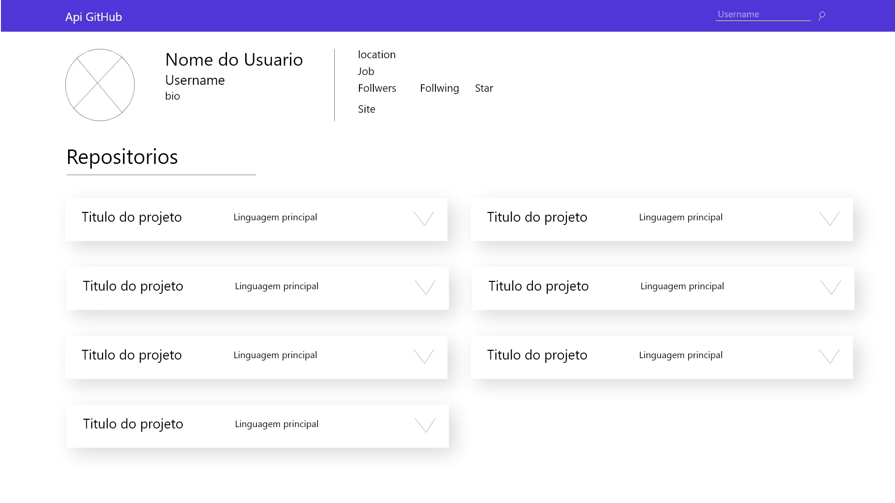
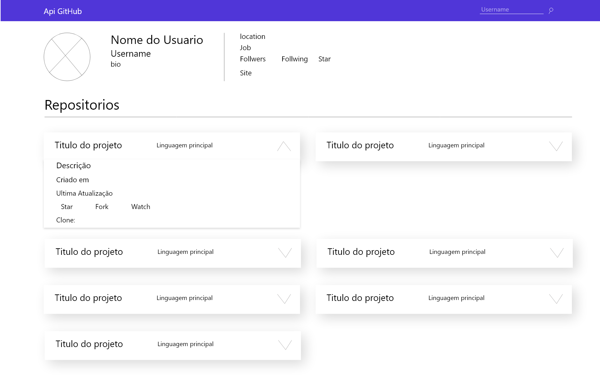

# TesteAngular

Aplicação angular que busca repositórios de um usuário, através da API do GitHub.

## Instalando Projeto

Primeiro passo é fazer o clone do projeto com o seguinte comando: `git clone https://github.com/DevFelipeSilva/teste-angular.git`.

Depois de clonado, navegue até o projeto através de um prompt de comando e execute o seguinte comando: `npm install`.

## Inicializando projeto

Execute `ng serve --open` para iniciar o  projeto. Navegue para `http://localhost:4200/`. E a aplicação já estará rodando.

## Executando testes unitários

Execute `ng test` para rodar os testes via [Karma](https://karma-runner.github.io).

## Telas do Prtotipo do projeto

